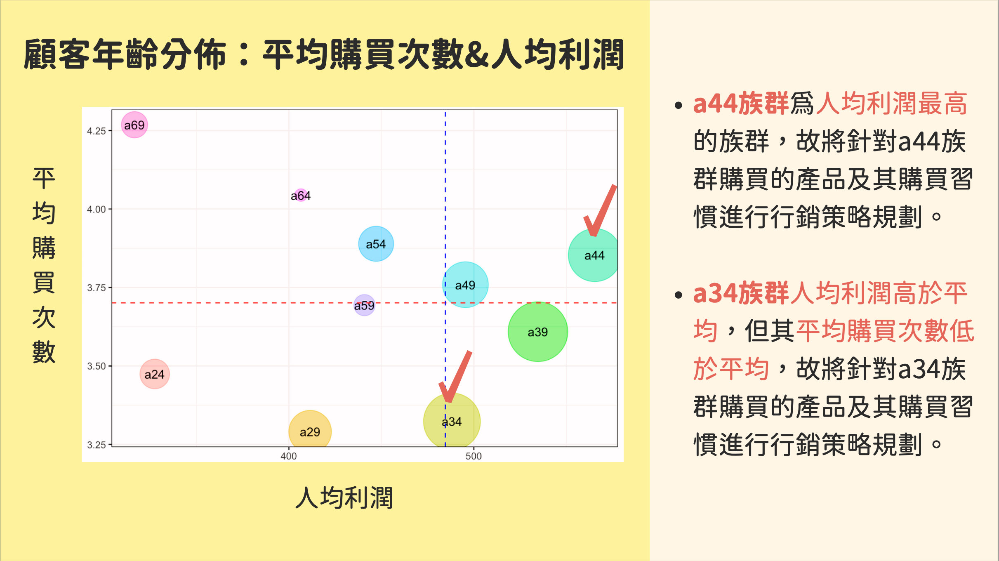
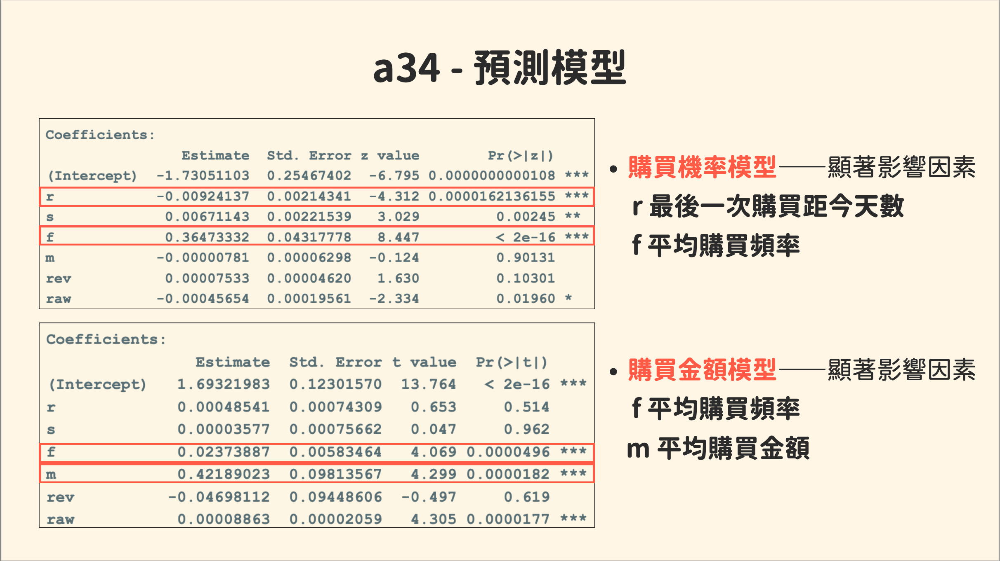
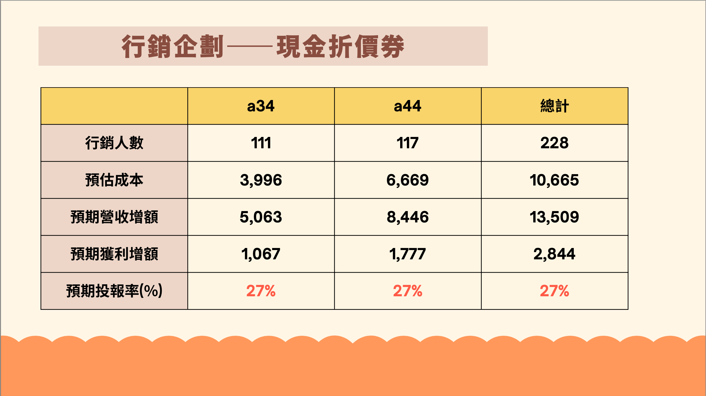

# Customer Segmentation & Marketing Optimization

## 📌 Problem
The business lacked a structured approach to identify high-value customer segments and allocate marketing resources efficiently.  
Without data-driven targeting, marketing investments were prone to low ROI and inefficient customer engagement.

---

## 💡 Solution
Developed an end-to-end customer analytics framework integrating segmentation, predictive modeling, and marketing ROI simulation.

**Key components:**
- Identified high-value customer segments based on behavioral and profitability metrics  
- Built predictive models to estimate purchase probability and expected spending  
- Simulated marketing strategies to optimize resource allocation and maximize ROI  

---

## 🔍 Highlights
- Segmented customers into key cohorts (e.g., a34, a44) based on profitability and behavior  
- Built predictive models using **RFM variables (Recency, Frequency, Monetary)**  
- Estimated purchase probability and expected revenue at the customer level  
- Designed and evaluated multiple marketing strategies using cost-response functions  
- Conducted ROI simulations to determine optimal targeting size and budget allocation  

---

## 📈 Impact
- Identified high-potential customer segments for targeted marketing  
- Improved expected marketing ROI through optimized budget allocation  
- Enabled data-driven decision-making in campaign design  
- Demonstrated potential profit uplift across different marketing strategies  

---

## 📊 Sample Analysis Output

This section highlights key analytical outputs used to support business decision-making.

### Customer Segmentation Insight

Key customer segments were identified based on profitability and behavioral differences, forming the basis for targeted marketing strategy.

 

### Purchase Prediction Model

Purchase probability and expected spending were modeled using RFM variables (Recency, Frequency, Monetary).

 

### Marketing ROI Optimization

Marketing strategies were evaluated through ROI simulation to estimate profit uplift, optimal targeting size, and campaign efficiency.

---

## 📂 Data Resource

- Ta-Feng grocery transaction dataset (Taiwan retail dataset)  
- Public dataset accessed via Kaggle:  
  https://www.kaggle.com/datasets/chiranjivdas09/ta-feng-grocery-dataset  
- Originally collected from a Taiwanese retail company and widely used in academic research for customer behavior analysis, segmentation, and recommendation modeling  
- Data has been preprocessed and adapted for analytical demonstration purposes  

---

## 🛠 Tools
- R (data analysis, modeling, simulation)  
- Statistical modeling (regression-based prediction)  
- Customer segmentation (RFM framework)  
- Marketing analytics & ROI optimization  

---

## ⚠️ Disclaimer
This project uses publicly available datasets sourced from platforms such as Kaggle for academic and demonstration purposes only.  
The data may not fully reflect real-world business conditions, and all analyses are based on simplified assumptions.  
No proprietary or confidential business data is included.
